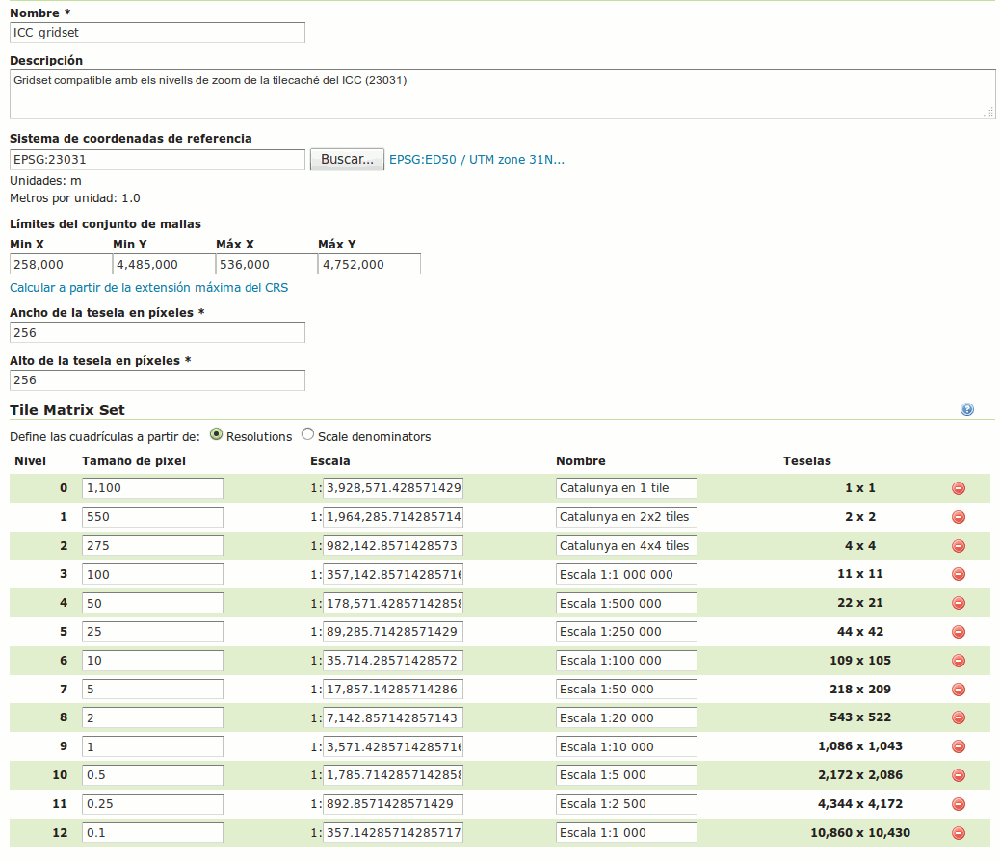

===================================
Instalación GeoServer en producción
===================================

Acerca de
=========

Documento publicado bajo licencia Creative Commons reconocimiento compartir-igual (CC-by-sa). Consultar autoría en el histórico de commits. Contribuciones bienvenidas.

Prerrequisitos
==============

Hardware y SO
-------------

* Sistema Operativo: Recomendado Ubuntu 16.04 Server 64 bits
* CPU: 2-4 cores
* RAM: 1-2 GB
* Disco: Según cantidad de datos a publicar (contar con la caché de teselas)

Configuración inicial de la máquina
-----------------------------------

Configurar conexión y nombre de la máquina::

	ifconfig eth0 <public_ip> <mask>
	route add default gw <gateway>

	echo "<nombre>" > /etc/hostname
	hostname -F /etc/hostname

/etc/hosts debería contener::

	127.0.0.1    localhost.localdomain  localhost
	<public_ip>  <nombre>.example.com   <nombre>

Zona horaria::

	dpkg-reconfigure tzdata

Actualizar paquetes::

	apt-get update
	apt-get upgrade

Activar la actualización automática de paquetes::

	sudo apt-get install unattended-upgrades
	sudo dpkg-reconfigure -plow unattended-upgrades

Algunas utilidades básicas::

	apt-get install locate
	updatedb

Instalar y configurar firewall (iptables)::

	apt-get install iptables

	iptables -A INPUT -i lo -j ACCEPT
	iptables -A INPUT -p tcp -m multiport --destination-ports 22,80,443,8080,8443,5432 -j ACCEPT # Dejar los que se necesiten
	iptables -A INPUT -m state --state RELATED,ESTABLISHED -j ACCEPT
	iptables -P INPUT DROP
	iptables -P FORWARD DROP

	iptables-save > /etc/iptables.rules

Crear /etc/network/if-pre-up.d/firewall con este contenidor::

	#!/bin/sh
	/sbin/iptables-restore < /etc/iptables.rules

Instalar fail2ban::

	apt-get install fail2ban
	service fail2ban restart

Crear usuarios SUDOers::

	adduser <name>
	adduser <name> sudo

Bloquear login de ROOT vía SSH. Cambiar esta línea /etc/ssh/sshd_config::

	PermitRootLogin no

Reiniciar servicio ssh::

	service ssh reload

Evitar el error 'too many files open'...

Añadir estas líneas a /etc/security/limits.conf ::

    *                hard    nofile          65535
    *                soft    nofile          65535
    root             hard    nofile          65535
    root             soft    nofile          65535

Tras reiniciar la máquina, comprobar límite con::

	ulimit -n

Instalar fuentes de Microsoft::

	apt-get install ttf-mscorefonts-installer

Instalar OpenJDK JRE 8 y Tomcat 8::

	apt-get install openjdk-8-jre
	apt-get install tomcat8

Añadir JAI y JAI-ImageIO nativos::

	cd /usr/lib/jvm/java-8-openjdk-amd64
	wget http://download.java.net/media/jai/builds/release/1_1_3/jai-1_1_3-lib-linux-amd64-jdk.bin
	sh jai-1_1_3-lib-linux-amd64-jdk.bin

	wget http://download.java.net/media/jai-imageio/builds/release/1.1/jai_imageio-1_1-lib-linux-amd64-jdk.bin
	export _POSIX2_VERSION=199209
	sh jai_imageio-1_1-lib-linux-amd64-jdk.bin

Reiniciar server	

	service tomcat8 restart

Instalar GDAL (1.11)::

	apt-get install gdal-bin

PostGIS
=======

Instalar PostgreSQL y PostGIS::

	apt-get install postgresql postgis
	apt-get install postgresql-9.5-postgis-2.2

Habilitar acceso local. En /etc/postgresql/9.5/main/pg_hba.conf::

	# TYPE  DATABASE        USER            ADDRESS                 METHOD
	local   all             postgres                                ident
	local   all             all                                     md5
	host    all             all             127.0.0.1/32            md5

Y en /etc/postgresql/9.5/main/postgresql.conf, descomentar::

    listen_addresses = 'localhost'

Reiniciar para aplicar cambios::

	service postgresql restart

Para acceder a la consola SQL::

	sudo -u postgres psql

Crear un nuevo "usuario"::

	CREATE USER usuario LOGIN PASSWORD '------' NOSUPERUSER INHERIT NOCREATEDB NOCREATEROLE;

Crear una nueva BDD "geodatos" cuyo propietario sea "usuario"::

	sudo -u postgres createdb -O usuario geodatos

Habilitar capacidades "geo" en la base de datos::

	sudo -u postgres psql -d geodatos -c "CREATE EXTENSION postgis;"

Acceso remoto abriendo puerto
-----------------------------

En caso de tener que abrir directamente un puerto (opción menos segura):

  1. En /etc/postgresql/9.5/main/postgresql.conf::

       listen_addresses = '*' # O mejor, una lista de IPs, si son fijas.

  2. En /etc/postgresql/9.5/main/pg_hba.conf, añadir una línea específica de acceso para una combinación de IP, BDD y usuario determinados (a ser posible, no usar comodines o "all" para el acceso remoto).

Configuración de SSL (https) en tomcat 8
========================================

1. Autogenerar certificado (para pruebas; usar certificado real en producción)::

	cd /var/lib/tomcat8
	keytool -genkey -alias admin -keypass adminpass -keystore certificate.bin -storepass adminpass -keyalg RSA
	chown tomcat8:tomcat8 certificate.bin

2. Configurar `/var/lib/tomcat8/conf/server.xml` para usar los puertos 80 y 443::

    <Connector port="80" protocol="HTTP/1.1"
               connectionTimeout="20000"
               URIEncoding="UTF-8"
               redirectPort="443" />

    <Connector port="443" protocol="HTTP/1.1" SSLEnabled="true"
               maxThreads="150" scheme="https" secure="true"
               clientAuth="false" sslProtocol="TLS"
               sslEnabledProtocols="v1.2,TLSv1.1,TLSv1"
               keystoreFile="certificate.bin" keystorePass="adminpass" />

3. Permitir a Tomcat usar puertos estándard, por debajo de 1024, usando authbind::

	apt-get install authbind

	touch /etc/authbind/byport/80
	chmod 500 /etc/authbind/byport/80
	chown tomcat8 /etc/authbind/byport/80

	touch /etc/authbind/byport/443
	chmod 500 /etc/authbind/byport/443
	chown tomcat8 /etc/authbind/byport/443

4. Editar /etc/default/tomcat8 y editar la directiva AUTHBIND::

	AUTHBIND=yes

5. Si sólo se quiere usar HTTPS, forzar su uso para todas las aplicaciones, inhabilitando el puerto HTTP. Añadir este contenido a /var/lib/tomcat8/conf/web.xml::

    <security-constraint>
        <web-resource-collection>
            <web-resource-name>Protected Context</web-resource-name>
            <url-pattern>/*</url-pattern>
        </web-resource-collection>
        <user-data-constraint>
            <transport-guarantee>CONFIDENTIAL</transport-guarantee>
        </user-data-constraint>
    </security-constraint>

6. Reiniciar tomcat::
	
	service tomcat8 restart

GeoServer
=========

Instalación base
----------------

GeoServer 2.9.0 (o "latest stable")::

	cd /var/lib/tomcat8/webapps/
	wget http://sourceforge.net/projects/geoserver/files/GeoServer/2.9.0/geoserver-2.9.0-war.zip
	apt-get install unzip
	unzip geoserver-2.9.0-war.zip
	rm -rf target/ *.txt geoserver-2.9.0-war.zip

Entorno JVM
-----------

Mover el GEOSERVER_DATA_DIR fuera de los binarios::

	mv /var/lib/tomcat8/webapps/geoserver/data /var/local/geoserver
	mkdir /var/local/geowebcache
	chown tomcat8:tomcat8 /var/local/geowebcache

Editar el fichero /etc/default/tomcat8 y añadir al final las rutas a Java, los datos, la caché, y parámetros de optimización::

	JAVA_HOME=/usr/lib/jvm/java-8-openjdk-amd64

	GEOSERVER_DATA_DIR=/var/local/geoserver
	GEOWEBCACHE_CACHE_DIR=/var/local/geowebcache

	JAVA_OPTS="-server -Djava.awt.headless=true -Xms512m -Xmx1536m -XX:+UseConcMarkSweepGC -XX:NewSize=48m -DGEOSERVER_DATA_DIR=$GEOSERVER_DATA_DIR -DGEOWEBCACHE_CACHE_DIR=$GEOWEBCACHE_CACHE_DIR"

Reiniciar tomcat::

	service tomcat8 restart

Comprobación entorno
....................

Entrar a::

	http://<maquina>:8080/geoserver/web/

En "server status", combrobar que:
  * El Data directory apunta a /var/lib/geoserver_data
  * La JVM es la instalada (OpenJDK 1.8 64 bits)
  * Native JAI y Native JAI ImageIO están a "true"

Seguridad
---------

Seguir las notificaciones de seguridad que aparecen en la página principal de GeoServer:

  * Cambiar password de "admin".
  * Cambiar el master password.

Configuración Web
-----------------

Bajo "About & Status":

* Editar la información de contacto. Esto aparecerá en los servicios WMS públicos: dejar a "Claudius Ptolomaeus" es indecente.

Bajo "Data":

* Borrar todos los espacios de trabajo (workspaces) existentes.
* Borrar todos los estilos existentes (dirá que hay 4 que no los puede borrar, esto es correcto).

Bajo "Services":

* WCS: Deshabilitar si no va a usarse.
* WFS: Cambiar el nivel de servicio a "Básico" (a menos que queramos permitir la edición remota de datos vectoriales).
* WMS: En "Limited SRS list", poner sólo las proyecciones que deseamos anunciar en nuestro servicio WMS. Esto reduce el tamaño del GetCapabilities. Por ejemplo: **23029, 23030, 23031, 25829, 25830, 25831, 4230, 4258, 4326, 3857, 900913**.

Bajo "Settings":

* Global: Cambiar el nivel de logging a PRODUCTION_LOGGING.

Bajo "Tile Caching":

* Caching Defaults: Activar los formatos "image/png8" para capas vectoriales, "image/jpeg" para capas ráster, y ambas para los grupos de capas.

* Disk Quota: Habilitar la cuota de disco. Tamaño máximo algo por debajo de la capacidad que tenga la unidad de Tile Caché.

Cambio de datum con malla NTv2
------------------------------

Descargar el fichero de malla de:

  https://github.com/oscarfonts/gt-datumshift/blob/master/icc-tests/src/test/resources/org/geotools/referencing/factory/gridshift/100800401.gsb?raw=true

Copiar el fichero de malla en user_projections::

  cp 100800401.gsb /var/lib/geoserver_data/user_projections/
  chown tomcat8:tomcat8 100800401.gsb

Forzar que se use también para la proyección Google Earth. Crear un fichero en user_projections llamado epsg_operations.properties, con el siguiente contenido::

  4230,4258=PARAM_MT["NTv2", PARAMETER["Latitude and longitude difference file", "100800401.gsb"]]
  4230,4326=PARAM_MT["NTv2", PARAMETER["Latitude and longitude difference file", "100800401.gsb"]]

Cambiar el owner::

  chown tomcat8:tomcat8 epsg_operations.properties

Reiniciar GeoServer::

  service tomcat8 restart

Comprobar que se utiliza la malla para reproyectar entre "EPSG:4230" y "EPSG:4258", y entre "EPSG:4230" y "EPSG:4326".

Esto se puede comprobar en la web de GeoServer, bajo "Demos" => Reprojection Console.

Añadir soporte para formatos ECW y SID
--------------------------------------

1. Instalar la extensión "GDAL" correspondiente a la versión de GeoServer: http://sourceforge.net/projects/geoserver/files/GeoServer%20Extensions/

::

	cd /var/lib/tomcat8/webapps/geoserver/WEB-INF/lib/
	wget http://sourceforge.net/projects/geoserver/files/GeoServer%20Extensions/2.9.0/geoserver-2.9.0-gdal-plugin.zip
	unzip geoserver-2.9.0-gdal-plugin.zip
	rm *.txt *.TXT *.zip
	chown tomcat8:tomcat8 *.jar

2. Instalar las definiciones CRS (gdal_data)::

	cd /var/lib/geoserver_data
	mkdir gdal
	cd gdal
	wget http://demo.geo-solutions.it/share/github/imageio-ext/releases/1.1.X/1.1.8/gdal/gdal-data.zip
	unzip gdal-data.zip

3. Instalar las librerías nativas de GDAL::

	mkdir lib
	cd lib
	wget http://demo.geo-solutions.it/share/github/imageio-ext/releases/1.1.X/1.1.8/gdal/linux/gdal192-Ubuntu12-gcc4.6.3-x86_64.tar.gz
	tar -xvf gdal192-Ubuntu12-gcc4.6.3-x86_64.tar.gz

4. Añadir variables de entorno, a /etc/default/tomcat8::

	export GDAL_DATA=$GEOSERVER_DATA_DIR/gdal/gdal-data
	export LD_LIBRARY_PATH=$GEOSERVER_DATA_DIR/gdal/lib

5. Cambiar permisos y reiniciar tomcat::

	chown -R tomcat8:tomcat8 /var/lib/geoserver_data/
	service tomcat8 restart

Se listarán los nuevos formatos al crear un almacén de datos raster.

.. warning::
   Utilizar ECW en un servidor sin comprar una licencia a ERDAS es ilegal.

   Para usar el formato ECW en un servidor de mapas, es necesario leer y aceptar esto: http://demo.geo-solutions.it/share/github/imageio-ext/releases/1.1.X/1.1.7/native/gdal/linux/ECWEULA.txt

Extensiones Oficiales
---------------------

CSS. Simbolizar más fácil que con SLD::

	https://sourceforge.net/projects/geoserver/files/GeoServer/2.9.0/extensions/geoserver-2.9.0-css-plugin.zip

Importer. Crear capas de un conjunto de tablas PostGIS o de ficheros ráster sin tener que ir una a una::

	https://sourceforge.net/projects/geoserver/files/GeoServer/2.9.0/extensions/geoserver-2.9.0-importer-plugin.zip

Control Flow. Evita sobresaturar el servidor::

	https://sourceforge.net/projects/geoserver/files/GeoServer/2.9.0/extensions/geoserver-2.9.0-control-flow-plugin.zip

	http://docs.geoserver.org/latest/en/user/extensions/controlflow/index.html

LibJPEG Turbo. Acelera salida en JPEG::

	http://sourceforge.net/projects/libjpeg-turbo/files/1.3.0/libjpeg-turbo-official_1.3.0_amd64.deb

	dpkg -i libjpeg-turbo-official_1.3.0_amd64.deb

	Añadir /opt/libjpeg-turbo/lib64 a LD_LIBRARY_PATH en /etc/default/tomcat8.

	https://sourceforge.net/projects/geoserver/files/GeoServer/2.9.0/extensions/geoserver-2.9.0-libjpeg-turbo-plugin.zip

Printing (a partir de GS 2.6.0; si se instala una versión anterior, ver siguiente párrafo "Extensiones community")::

	wget https://sourceforge.net/projects/geoserver/files/GeoServer/2.9.0/extensions/geoserver-2.9.0-printing-plugin.zip
	
	unzip en WEB-INF/lib y cambiar permisos
	
Para que se pueda imprimir en diferentes formatos (gif, png, tiff) después de instalar la extensión printing hay que añadir la librería fontbox::
	
	sudo wget https://archive.apache.org/dist/pdfbox/1.6.0/fontbox-1.6.0.jar
	sudo chown tomcat8. fontbox-1.6.0.jar
	sudo service tomcat8 restart
	

Extensiones "community"
-----------------------

Cómo compilarlas
................

No están mantenidas oficialmente, y no forman parte del "build" oficial. Hay que compilarlos desde las fuentes::

	git clone git@github.com:geoserver/geoserver.git
	cd geoserver
	# git tag -l
	git checkout -b tags/2.9.0
	cd src/community
	mvn clean install -PcommunityRelease,proxy -DskipTests
	mvn assembly:single
	# Proxy jar generated in: proxy/target/gs-proxy-2.9.0.jar
	# Printing extension generated in: target/release/geoserver-2.9.0-printing-plugin.zip

Cómo configurarlas
..................

Ejemplo de configuración para la extensión de printing (copiar en /var/lib/geoserver_data/printing/):

https://dl.dropboxusercontent.com/u/2368219/geoserver/config.yaml

Esquemas de teselado
--------------------

Aumentar resolución para EPSG:4326
...................................

Si se quiere mayor resolución en los KML superoverlays autogenerados por el servicio GWC, hay que sobreescribir la definición del gridset "EPSG:4326" editando directamente el fichero en disco. En este caso, añadiremos los niveles 23, 24 y 25, que aumentan la resolución máxima en un orden de magnitud. Localizar el fichero $GEOWEBCACHE_CACHE_DIR/geowebcache.xml, y añadir el siguiente gridset::

	<gridSet>
      <name>EPSG:4326</name>
      <description>A default WGS84 tile matrix set where the first zoom level covers the world with two tiles on the horizonal axis and one tile over the vertical axis and each subsequent zoom level is calculated by half the resolution of its previous one.</description>
      <srs>
        <number>4326</number>
      </srs>
      <extent>
        <coords>
          <double>-180.0</double>
          <double>-90.0</double>
          <double>180.0</double>
          <double>90.0</double>
        </coords>
      </extent>
      <alignTopLeft>false</alignTopLeft>
      <resolutions>
        <double>0.703125</double>
        <double>0.3515625</double>
        <double>0.17578125</double>
        <double>0.087890625</double>
        <double>0.0439453125</double>
        <double>0.02197265625</double>
        <double>0.010986328125</double>
        <double>0.0054931640625</double>
        <double>0.00274658203125</double>
        <double>0.001373291015625</double>
        <double>6.866455078125E-4</double>
        <double>3.433227539062E-4</double>
        <double>1.716613769531E-4</double>
        <double>8.58306884766E-5</double>
        <double>4.29153442383E-5</double>
        <double>2.14576721191E-5</double>
        <double>1.07288360596E-5</double>
        <double>5.3644180298E-6</double>
        <double>2.6822090149E-6</double>
        <double>1.3411045074E-6</double>
        <double>6.705522537E-7</double>
        <double>3.352761269E-7</double>
        <double>1.676380634E-7</double>
        <double>8.38190317E-8</double>
        <double>4.19095159E-8</double>
      </resolutions>
      <metersPerUnit>111319.49079327358</metersPerUnit>
      <pixelSize>2.8E-4</pixelSize>
      <scaleNames>
        <string>EPSG:4326:0</string>
        <string>EPSG:4326:1</string>
        <string>EPSG:4326:2</string>
        <string>EPSG:4326:3</string>
        <string>EPSG:4326:4</string>
        <string>EPSG:4326:5</string>
        <string>EPSG:4326:6</string>
        <string>EPSG:4326:7</string>
        <string>EPSG:4326:8</string>
        <string>EPSG:4326:9</string>
        <string>EPSG:4326:10</string>
        <string>EPSG:4326:11</string>
        <string>EPSG:4326:12</string>
        <string>EPSG:4326:13</string>
        <string>EPSG:4326:14</string>
        <string>EPSG:4326:15</string>
        <string>EPSG:4326:16</string>
        <string>EPSG:4326:17</string>
        <string>EPSG:4326:18</string>
        <string>EPSG:4326:19</string>
        <string>EPSG:4326:20</string>
        <string>EPSG:4326:21</string>
        <string>EPSG:4326:22</string>
        <string>EPSG:4326:23</string>
        <string>EPSG:4326:24</string>
      </scaleNames>
      <tileHeight>256</tileHeight>
      <tileWidth>256</tileWidth>
      <yCoordinateFirst>false</yCoordinateFirst>
    </gridSet>

Teselado del ICC
................

La Tile Caché del ICC sigue un esquema de teselado particular, distinto al utilizado habitualmente por la mayoría de aplicaciones de web mapping. Por tanto, debe definirse en GeoServer este esquema particular de teselado:

* Sistema de coordenadas: EPSG:23031
* Límites:

   * Min X:  258000
   * Min Y: 4485000
   * Máx X:  536000
   * Máx Y: 4752000

* Ancho y alto tesela: 256 x 256 px.

Matriz de teselas, defiida a partir de resolución en m/px:

===== ================ ======================
Nivel Tamaño del píxel Nombre
===== ================ ======================
0     1100             Catalunya en 1 tile
1     550              Catalunya en 2x2 tiles
2     275              Catalunya en 4x4 tiles
3     100              Escala 1:1 000 000
4     50               Escala 1:500 000
5     25               Escala 1:250 000
6     10               Escala 1:100 000
7     5                Escala 1:50 000
8     2                Escala 1:20 000
9     1                Escala 1:10 000
10    0.5              Escala 1:5 0000
11    0.25             Escala 1:2 500
12    0.1              Escala 1:1 000
===== ================ ======================

Migración de los datos
======================

PostGIS
-------

Exportar el archivo SQL. La opción --inserts es importante para la exportación. Si no, ejecuta comandos 'copy'::

	/usr/bin/pg_dump --inserts -h localhost -U user_castellbisbal -W gdb_castellbisbal > ctbb.dump

Restaurar el archivo ctbb.dump::

	> sudo -u user_castellbisbal psql
	\c gdb_castellbisbal
	\i ctbb.dump
	
Geoserver
---------

1- crear el workspace ctbb_portal

2- con la herramienta ImportData (extensión Importer), publicar las capas en ctbb_portal

3- la importación automática de estilos ha dado errores

	https://jira.codehaus.org/browse/GEOS-6107
	
por lo que se ha hecho manualmente copiando SLD

4- copiar directorio /graphics en /styles y cambiar permisos::

	sudo chown -R tomcat8. graphics/
	
5- copiar y pegar carpeta /templates y cambiar permisos::

	sudo chown -R tomcat8. templates/
	
	
Geoexplorer
-----------

1- crear /var/lib/geoexplorer_data

2- en Geoexplorer, cambiar GEOEXPLORER_DATA a /var/lib/geoexplorer_data en web.xml y app.proxy.geoserver=http://geoserver.fonts.cat/web/ en build.properties

3- crear archivo .war y subirlo a /var/lib/tomcat8/webapps::

	ant -Dgeoexplorer.data=profiles/ctbb-portal dist
